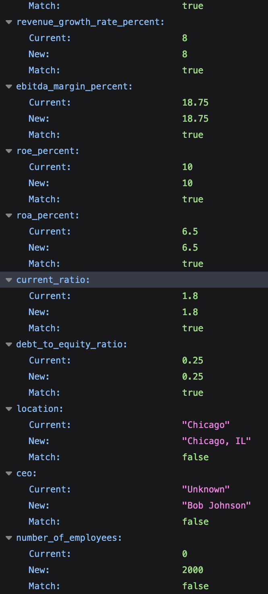

# Hello Lantern!

I hope I've approached this task with what you had in mind.

I've added some details in the testing approach of how I would approach this with more time, as well as some 
notes of where I'm trying to mock a system close to a production ready setup.

If I had some more time I'd of loved to do containerizing and creating interfaces for the services for dependency injection.

Here are a few of the test URLs to verify the implementation:
```
http://127.0.0.1:8000/compare?company_name=HealthInc&pdf=healthinc

http://127.0.0.1:8000/compare?company_name=FinanceLLC&pdf=financellc

http://127.0.0.1:8000/compare?company_name=RetailCo&pdf=retailco

```
Here's a screenshot of the output, displaying the current values held by the "DB", 
compared to the new values of the PDF, marked with true or false if it matches.



Looking forward to speaking with you soon, if you have any questions please
 email me at [will@developerfy.com](mailto:will@developerfy.com)

 Thanks - Will.

# Data discrepancy checker

This task mirrors a system we recently built internally, and will give you an
idea of the problems we need to solve.

Every quarter, new company data is provided to us in PDF format. We need to use
an external service to extract this data from the PDF, and then validate it
against data we have on file from another source.

Complete the API so that:

A user can provide a PDF and a company name data is extracted from the PDF via
the external service and compared to the data stored on file a summary of the
data is returned, containing all fields from both sources, noting which fields
did not match.

A selection of example PDFs have been uploaded, and the PDF
extraction service has been mocked for use in `src/pdf_service.py` - DO NOT
EDIT THIS FILE. There is simple documentation of the service in
`PDF_SERVICE_DOCS.md`. You can treat this as just another microservice.

The existing data we have on file is available in the `data/database.csv` file.

Treat this code as if it will be deployed to production, following best
practices where possible.

## Setup using Poetry

The easiest way to set up the repository is to use `python-poetry`. The lock file
was generated using version `1.8.3`

1. Ensure `poetry` is installed
2. Run `make install`

## Setup without Poetry

Alternatively it's possible to `pip install` directly using the
`pyproject.toml` or `requirements.txt`.
